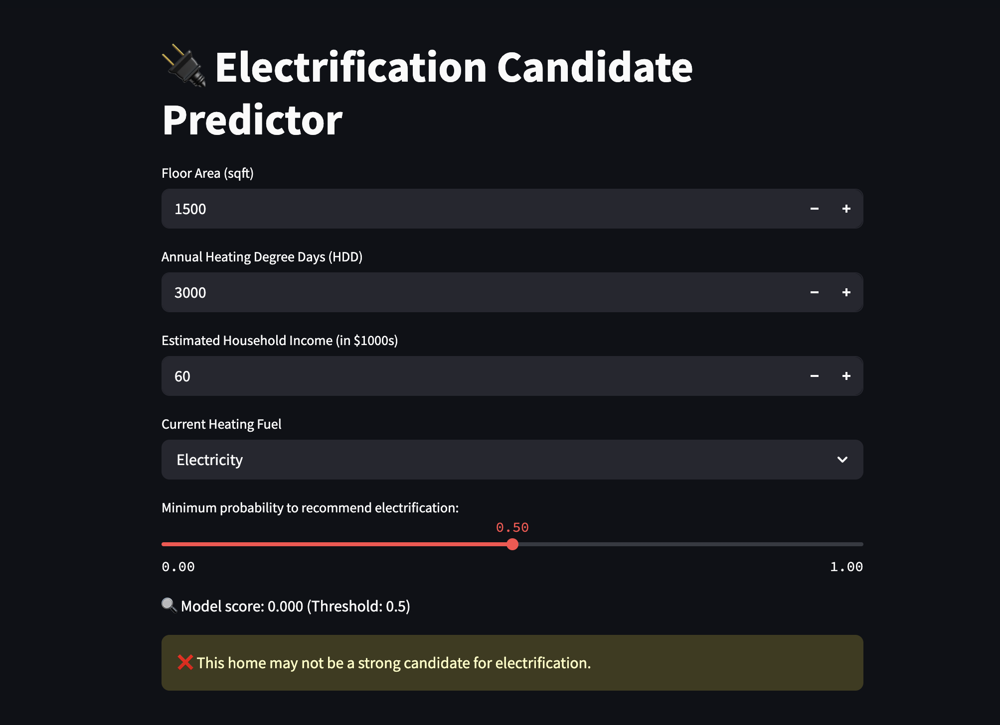
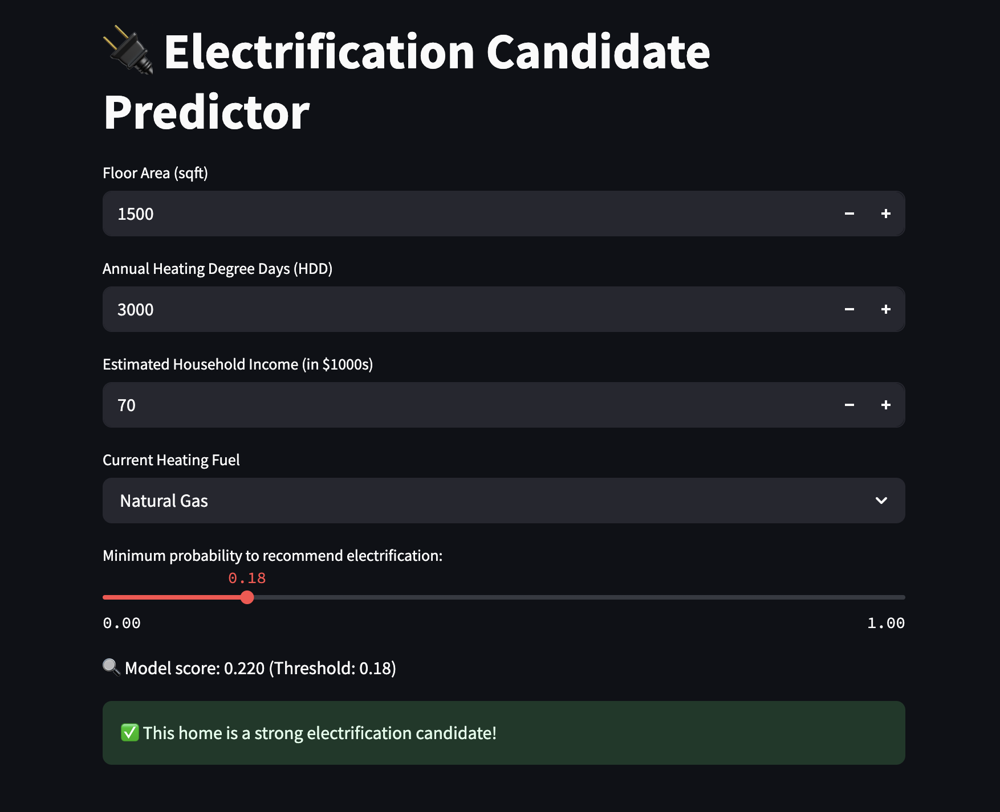

# 🔌 Electrification Candidate Predictor

A Streamlit web app powered by a machine learning model that predicts whether a U.S. home is a strong candidate for HVAC electrification — based on floor area, fuel type, regional climate, and income.

## 💡 Project Motivation

This was built as a hands-on ML. It simulates a real use case of identifying electrification-ready homes for HVAC contractors or incentive programs.

## 🚀 Features

- Trained on real-world data (EIA RECS 2020 + NOAA weather + ZIP-level income)
- Predicts electrification candidacy from 4 input features
- Uses a Random Forest model with SHAP for explainability
- Interactive Streamlit UI with adjustable confidence threshold

## 📸 Demo




## 🛠️ How to Run Locally

1. Clone the repo

```bash
git clone https://github.com/YOUR_USERNAME/electrification-predictor-RandomForest.git
